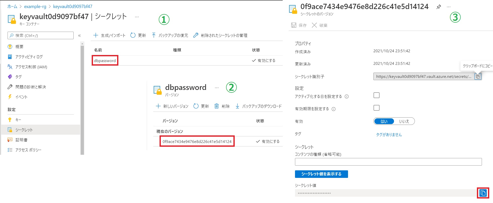
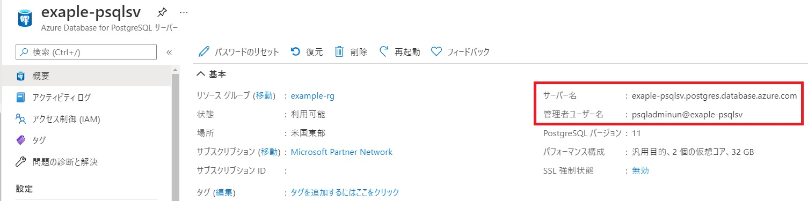
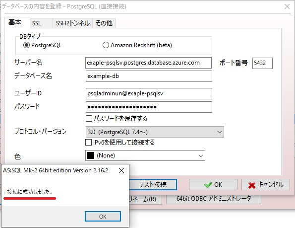

# Postgres-KeyVault
Store the DB Password in the Azure Key Vault by Terraform

## セットアップ（Linux）
terraform install

https://learn.hashicorp.com/tutorials/terraform/install-cli

Azure CLI install

https://docs.microsoft.com/ja-jp/cli/azure/install-azure-cli-linux?pivots=apt

Azureへのログイン

    $ az login

tfstateファイルをAzure Storageに格納する。

https://docs.microsoft.com/ja-jp/azure/developer/terraform/store-state-in-azure-storage?tabs=azure-cli

## リソース作成
    $ terraform plan
    $ terraform apply
    
## Databaseへの接続
パスワードの確認

接続文字列の確認

A5M2でテスト接続 

参考URL
https://jakewalsh.co.uk/automating-azure-key-vault-and-secrets-using-terraform/